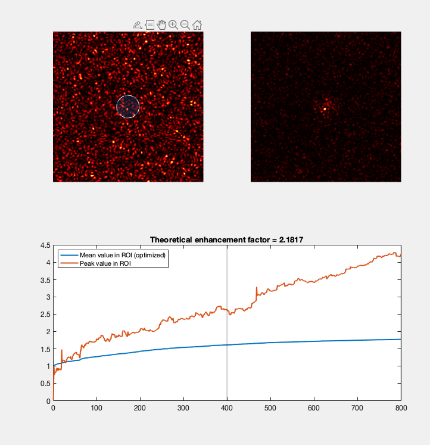

# Wavefront shaping - Simulations

This repository contains a Matlab code that simulates the optimisation of the mean light intensity within a given region of interest.

The simulated physical configuration is the following: 

- a flat-phase optical wavefront is impinging on a spatial light modulator (SLM) (phase modulation only).
- a camera is located the far-field/Fourier plane of the SLM and measures the light intensity of the produced speckle

Light focusing is attempted by shaping the phase pattern displayed on the SLM. The optimized signal is the averaged light intensity within a given region of interest (ROI), eventually with some non-linearity. The ROI can be a disk, a square, or a gaussian weighted profile (so not really a ROI in this case).

# How to use it

Open the function with Matlab and run, all required custom functions are stored at the end of the code.

# Basic operations

## Parameters

The parameters that can be used are:

- the grid size (over which the output speckle pattern),
- the speckle grain size, 
- the number of SLM actuators (or input degrees of freedom).
- the number of iterations
- the non-linearity coefficient

To provide some insights about the real-life possibilities of such an optimisation with a photoacoustic feedback as the optimised signal, we set the relative size of the optical wavelength and the acoustic one.
The physical parameters that are driving this are:

- the optical wavelength `lambda`
- the acoustic frequency `fUS`
- the acoustic numerical aperture `NAUS`

To mimic the sensitivity profile of a single element ultrasonic transducer, we use a gaussian profile to compute the feedback signal (see ROI above).

Speckle grains are assumed to be diffraction limited, such as there physical size is $`\lambda/2`$. However, this is quite overestimated as we should get a much larger numerical aperture. And we consider here only a 2D speckle pattern, whereas in tissue we should get a 3D one, increasing the number of speckle grains (or output modes) that contribute to the feedback signal. The performances of such an optimisation are therefore highly overestimated.

# Results

The output figure provides: 

- (top left) initial speckle pattern. The circle indicate the size of the optimized ROI (or FWHM of the gaussian profile)
- (top right) final speckle pattern
- (bottom) plot of the optimized signal ((if gaussian profile: weighted) mean intensity within ROI), and of the peak intensity within this ROI

# To do
- add Lorentzian weighting
- add transmission matrix measurement and focusing
- connect to k-wave to better simulate the acoustic part
- convert to jupyter notebook
